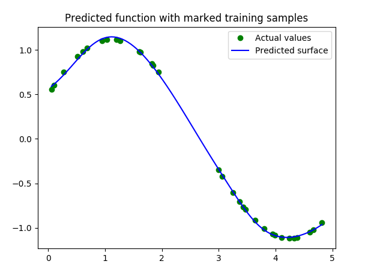
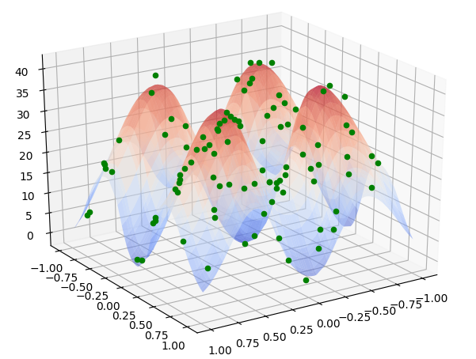
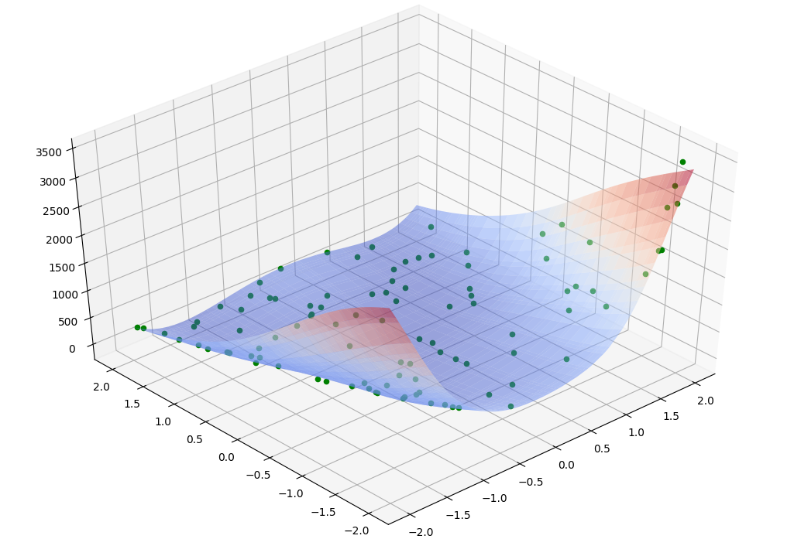

# ANN (wights trained with GA)
The artificial neural network (ANN) whose weights are trained by genetic algorithm (GA).

### Requirements
Install dependencies: 
```bash
pip install -r requirements.txt
```

How to run: `python runner.py [config_file] [architecture]`  //optional args   
Do not support: `python runner.py architecture` //must be config file if front of architecture


## Sine function
Configuration file:`config/sin_config.json`  
Run: `python runner.py config/sin_config.json`  
Results:
```bash
ARCHITECTURE: 1-7-sigmoid-1
Error at iteration 500 = 0.009299
Error at iteration 1000 = 0.005566
Error at iteration 1500 = 0.003317
Error at iteration 2000 = 0.001608
Error at iteration 2500 = 0.000968
Error at iteration 3000 = 0.000595
Error at iteration 3500 = 0.000350
Error at iteration 4000 = 0.000325
Training done, running on test set
Error on test set:  0.000295252571136
```
Real function:  
<p align="center">
  
</p>    
<p align="center">Sine function<p align="center">

Our approximation of function:   
<p align="center">
  
</p>   
<p align="center">Sine aproximation<p align="center">


## Rastrigin function
Configuration file:`config/rastrigin_config.json`   
Run: `python runner.py config/rastrigin_config.json`  
Results:
```bash
ARCHITECTURE: 2-17-sigmoid-1
Error at iteration 500 = 89.361780
Error at iteration 1000 = 60.838598
Error at iteration 1500 = 34.505020
Error at iteration 2000 = 12.416850
Error at iteration 2500 = 3.099398
Error at iteration 3000 = 1.660415
Error at iteration 3500 = 1.415576
Error at iteration 4000 = 1.177138
Training done, running on test set
Error on test set:  2.24786418972
```
Real function:  
<p align="center">
  
</p>    
<p align="center">Rastrigin function<p align="center">

Our approximation of function:  
<p align="center">
  
</p>   
<p align="center">Rastrigin aproximation<p align="center">


## Rosenbrock function
Configuration file:`config/rosenbrock_config.json`   
Run: `python runner.py config/rosenbrock_config.json`  
Results:
```bash
ARCHITECTURE: 2-7-sigmoid-3-3-1
Error at iteration 500 = 13654.545666
Error at iteration 1000 = 5576.021955
Error at iteration 1500 = 3245.428435
Error at iteration 2000 = 3159.627796
Error at iteration 2500 = 3128.003420
Error at iteration 3000 = 3086.432377
Error at iteration 3500 = 3057.572384
Error at iteration 4000 = 2799.001056
Error at iteration 4500 = 2769.251787
Error at iteration 5000 = 2751.550141
Error at iteration 5500 = 2685.235546
Error at iteration 6000 = 2384.235148
Error at iteration 6500 = 2240.055587
Error at iteration 7000 = 2205.560436
Error at iteration 7500 = 2111.052741
Error at iteration 8000 = 2067.577503
Error at iteration 8500 = 2058.406218
Error at iteration 9000 = 2055.049820
Error at iteration 9500 = 1933.511075
Error at iteration 10000 = 1924.211131
Training done, running on test set
Error on test set:  2758.93894153

```
Real function:
<p align="center">
  
</p>    
<p align="center">Rosenbrock function<p align="center">

Our approximation of function:  
<p align="center">
  
</p>   
<p align="center">Rosenbrock aproximation<p align="center">
